# 单周期 CPU 的 Verilog 设计与仿真

## 前言

中央处理器（CPU）是计算机取指令和执行指令的部件，它是由算数逻辑单元（ALU）、寄存器和控制单元等组成。CPU是计算机系统的核心部件，处理器的设计与制造也是计算机技术的核心之一。本课程Project考察了对数字部件设计课程涵盖的主要知识点的灵活运用以及Verilog语言的使用。

CPU设计的第一步应当根据指令系统建立数据路径，再定义各个部件的控制信号，确定时钟周期，完成控制器的设计，然后建立数据路径，进而进行数字设计、电路设计，最后完成物理实现。在本课程Project中，我们主要关注数据路径的建立和控制器的设计。

在本课程Project中，我们使用Verilog语言和Vivado 2015.2软件设计出了一个拥有13条指令的单周期CPU，并对其进行了仿真测试，最终完成了一个功能正确、性能优良的单周期CPU设计。

## 原理

单周期CPU的特点是，每条指令的执行需要一个时钟周期，一条指令执行完再执行下一条指令。一般来说，一个CPU在处理指令时需要经过以下几个步骤：

1. **取指令**：根据程序计数器（PC）中的指令地址，从指令内存中取出一条指令

2. **译码**：对取指令操作中得到的指令进行译码，确定这条指令需要完成的操作，从而产生相应的控制信号，驱动数据模块的各种操作 

3. **执行**：根据译码得到的控制信号，具体地执行指令动作

4. **访存**：给出储存器的数据地址，把数据写入到储存器中的数据地址所指定的位置或者从储存器中得到数据地址所指示的数据

5. **写回**：把指令执行的结果或者访存得到的数据写回相应的目的寄存器中

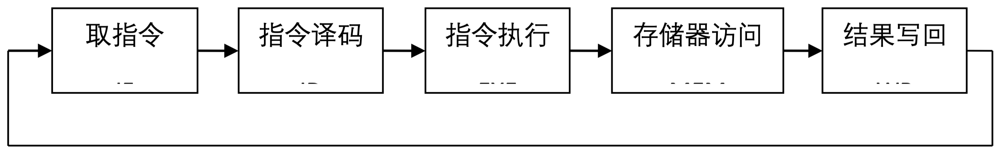

## 指令系统

我们使用MIPS指令集，实现了13个基本的指令，指令格式如下：

- `ADD rs rt rd`

| 000000 | rs(5) | rt(5) | rd(5) | 00000 | 100000 |
| ------ | ----- | ----- | ----- | ----- | ------ |

- `SUB rs rt rd`

| 000000 | rs(5) | rt(5) | rd(5) | 00000 | 100010 |
| ------ | ----- | ----- | ----- | ----- | ------ |

- `AND rs rt rd`

| 000000 | rs(5) | rt(5) | rd(5) | 00000 | 100100 |
| ------ | ----- | ----- | ----- | ----- | ------ |
|        |       |       |       |       |        |

- `OR rs rt rd`

| 000000 | rs(5) | rt(5) | rd(5) | 00000 | 100101 |
| ------ | ----- | ----- | ----- | ----- | ------ |

- `SLT rs rt rd`

| 000000 | rs(5) | rt(5) | rd(5) | 00000 | 101010 |
| ------ | ----- | ----- | ----- | ----- | ------ |

- `ADDI rs rt imm`

| 001000 | rs(5) | rt(5) | imm(16) |
| ------ | ----- | ----- | ------- |

- `ANDI rs rt imm`

| 001100 | rs(5) | rt(5) | imm(16) |
| ------ | ----- | ----- | ------- |

- `ORI rs rt imm`

| 001101 | rs(5) | rt(5) | imm(16) |
| ------ | ----- | ----- | ------- |

- `SLTI rs rt imm`

| 001010 | rs(5) | rt(5) | imm(16) |
| ------ | ----- | ----- | ------- |

- `SW base rt offset`

| 100011 | base(5) | rt(5) | offset(16) |
| ------ | ------- | ----- | ---------- |

- `LW base rt offset`

| 100011 | base(5) | rt(5) | offset(16) |
| ------ | ------- | ----- | ---------- |

- `J target`

| 000010 | target(26) |
| ------ | ---------- |

- `NOP`

| 000000 | 00000 | 00000 | 00000 | 00000 | 000000 |
| ------ | ----- | ----- | ----- | ----- | ------ |

## 控制信号说明

| 信号名 | 无效时作用（0）    | 有效时作用（1）  |
| ------ | ------------------ | ---------------- |
| JUMP   | 由BRANCH选择的地址 | 选择跳转目标地址 |
| M2REG  | ALU输出数据        | 选择存储器数据   |
| BRANCH | 下一地址           | 选择转移目标地址 |
| WMEM   | 不写入存储器       | 写入存储器       |
| SHIFT  | 选择寄存器数据     | 选择输入的移位数 |
| ALUIMM | 选择寄存器数据     | 选择扩展的立即数 |
| WREG   | 不写入寄存器       | 写入寄存器       |
| SEXT   | 符号扩展           | 0扩展            |
| REGRT  | 选择rt             | 选择rd           |

 ## 功能模块简述

- `INST_MEM`：指令内存，用来初始化和储存指令

- `CONTROL_UNIT`：控制单元，用来解析指令

- `REG_FILE`：寄存器，用来初始化和储存寄存器，包括对寄存器的读写操作

- `DATA_MEM`：数据内存，用来初始化和储存数据，包括对数据的读写操作

- `ALU`：算数逻辑单元，用来做计算操作

- `NEXT_PC`：PC计算单元，用来计算下一条指令地址

- `EXT`：立即数扩展，用来将16位的立即数扩展为32位的

- `MUX_5` & `MUX_32`：5位和32位选择器

## 功能模块要点

- `INST_MEM`
  - 输入为指令地址（PC），输出为一条指令
  - 输入一个 `RST` 信号用来控制初始化
  - Instruction Memory 一共 16 行，每行 32 位，即最多可以存放 16 条指令
  - 指令序列详见后文

- `CONTROL_UNIT`
  - 输入为从指令中解析出来的 `OP` 和 `Func`，输出为 `jump`, `m2reg`, `branch`, `wmem`, `shift`, `aluimm`, `wreg`, `regrt`, `sext`和 `aluc` 信号，用来控制其他模块的行为
  - `Branch` 信号在这个 PJ 中永远为 0
  - `Shift` 信号也是永远为 0
  - 由于这个 PJ 中只有五种 ALU 操作，所以 `Aluc` 只需要 3 位就可以了

- `REG_FILE`
  - 输入为三个寄存器地址 `n1`, `n2` 和 `nd`，写入寄存器的数据 `di`，控制写入信号 `we` 和时钟信号（ `clk` ）以及重置信号（ `rst` ）
  - 输出为两个 32 位的数据 `q1` 和 `q2`
  - 一共有 16 个 32 位的寄存器，除了第一个寄存器初始值为 0 之外，其他寄存器初始值为 -1（即 32 个 1）

- `DATA_MEM`
  - 输入为 32 位的地址，写入的数据，控制写入的信号 `we` 和时钟信号与重置信号
  - 输出为 32 位的读出数据
  - 内存大小 64*32，初始值置为 0
  - 在时钟下降沿写入数据

- `ALU`
  - 输入为操作数 `a` 和 `b`，以及控制操作类型的信号 `aluc`
  - 输出为计算结果
  - 由于这个 PJ 不需要用到 `zero` 信号，所以没有输出
- `NEXT_PC`
  - 输入为 `branch`、`jump` 等控制信号，`jump` 指令目标地址，当前 `pc`，指令立即数
  - 输出为下一个指令地址
  - PC 在增加到 15 后不再增加

## 性能提升设计

- 控制单元使用组合电路设计，提升性能

- 寄存器和数据内存的「读」操作使用组合电路实现，即地址改变后，读出数据即时改变

- 数据内存的写入在时钟下降沿完成，保证了写入的数据为稳定、正确的，并且使得整个操作可以在一个时钟周期内完成，提升了性能

## 测试指令说明

- 指令序列与其效果，寄存器初始状态: `R[0]=0, R[1]…R[15]=-1`

```
0.	addi, rs=0, rt=1, imm=1          	=> R[1]=1
1.	add, rs=0, rt=1, rd=2            	=> R[2]=1
2.	sub, rs=0, rt=1, rd=3            	=> R[3]=-1
3.	ori, rs=1, rt=4, imm=2           	=> R[4]=3
4.	andi, rs=1, rt=5, imm=1          	=> R[5]=1
5.	or, rs=1, rt=4, rd=6             	=> R[6]=3
6.	and, rs=1, rt=4, rd=7            	=> R[7]=1
7.	slt, rs=4, rt=1, rd=8            	=> R[8]=0
8.	slti, rs=3, rt=9, imm=1          	=> R[9]=1
9.	sw, base=R[1], rt=4, offset=1    	=> Data[2]=3
10.	j, address=3 << 2=12			    => jump to 12
11.	add, rs=0, rt=1, rd=11           	=> R[11]=1 this will NOT execute
12.	lw, base=R[1], rt=10, offset=1   	=> R[10]=3
13.	nop
14.	nop
15.	nop
```

- 指令序列完整测试了要求实现的十三条指令，并使得结果能够清晰地在仿真波形图中显现，详见后文的仿真截图

## 仿真截图

`rst` 信号发出，系统初始化完成，PC=0，准备执行第一条指令

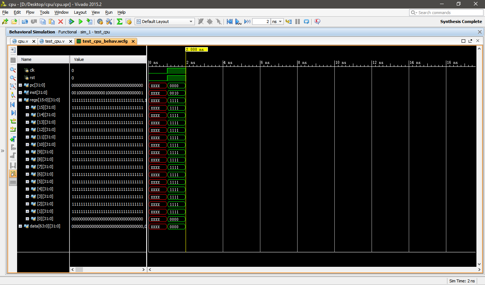`addi, rs=0, rt=1, imm=1 => R[1]=1`，将R[0]的值加上1结果赋给R[1]，可以看到在波形图中，R[1]的值变为了1

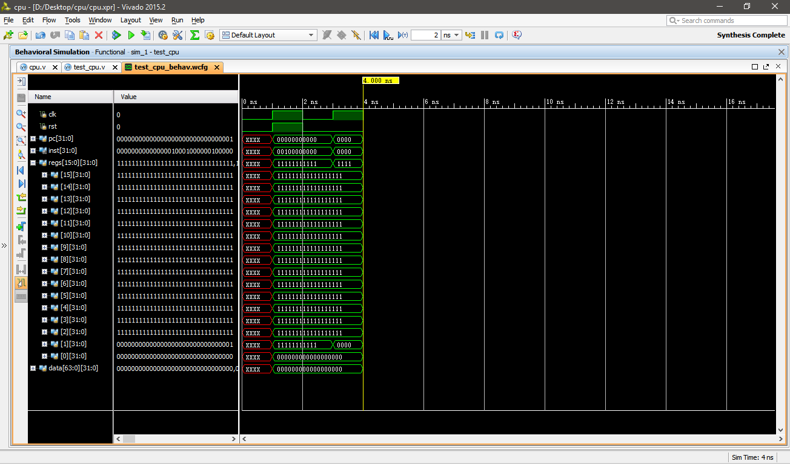

add, rs=0, rt=1, rd=2 => R[2]=1，将R[0]的值加R[1]的值结果赋给R[2]，可以看到波形图中R[2]的值变为了1

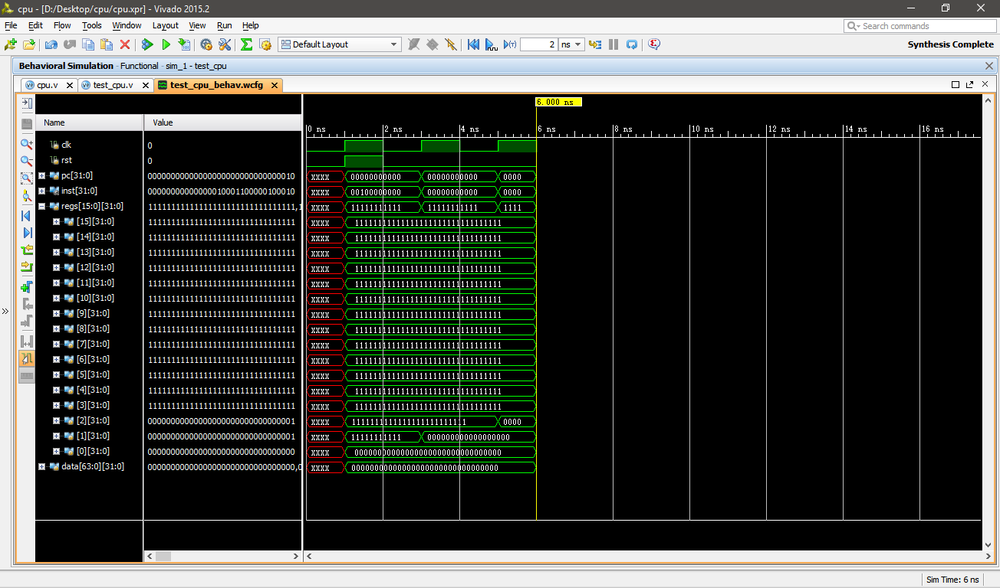

sub, rs=0, rt=1, rd=3 => R[3]=-1，将R[0]的值减去R[1]的值结果赋给R[3]，可以看到波形图中R[3]的值变成了-1

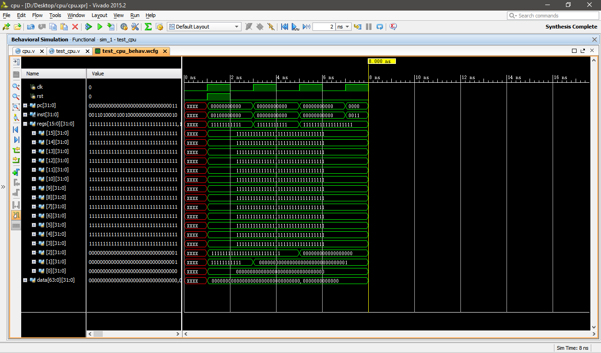ori, rs=1, rt=4, imm=2 => R[4]=3，将R[1]的值与2做「或」操作结果赋给R[4]，可以看到波形图中R[4]的值变成了3

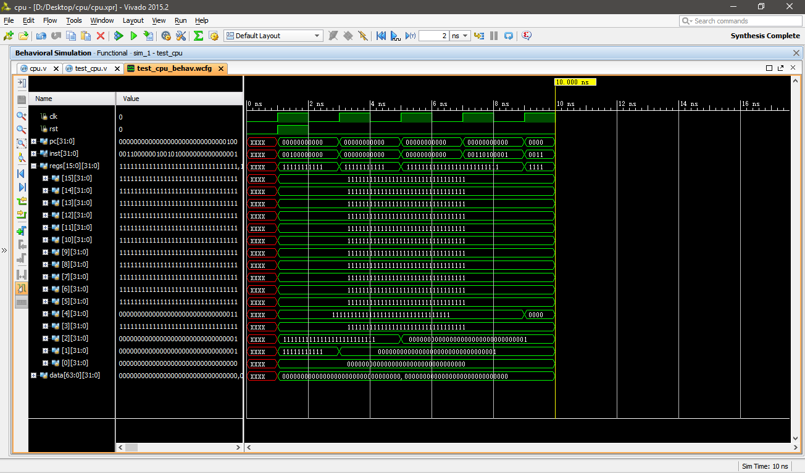

andi, rs=1, rt=5, imm=1 => R[5]=1，将R[1]的值与1做「与」操作结果赋给R[5]，可以看到波形图中R[5]的值变成了1

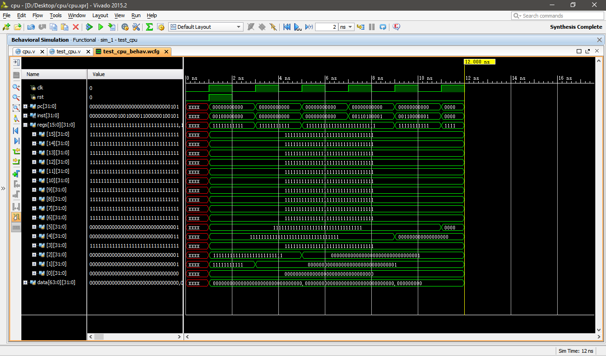

or, rs=1, rt=4, rd=6 => R[6]=3，将R[1]的值与R[4]的值做「或」操作，结果赋给R[6]，可以看到波形图中R[6]的值变成了3

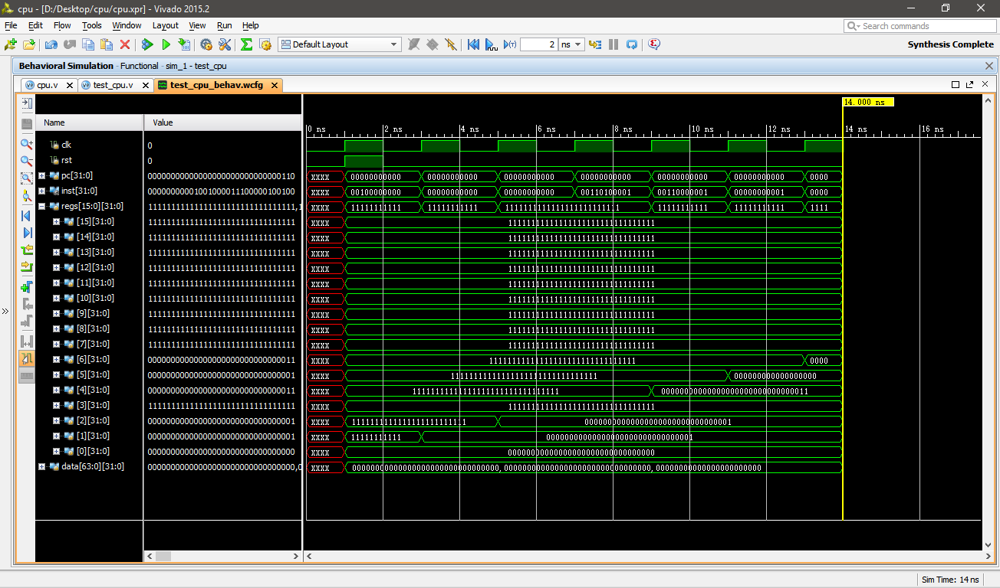and, rs=1, rt=4, rd=7 => R[7]=1，将R[1]的值与R[4]的值做「与」操作，结果赋给R[7]，可以看到波形图中R[7]的值变成了1

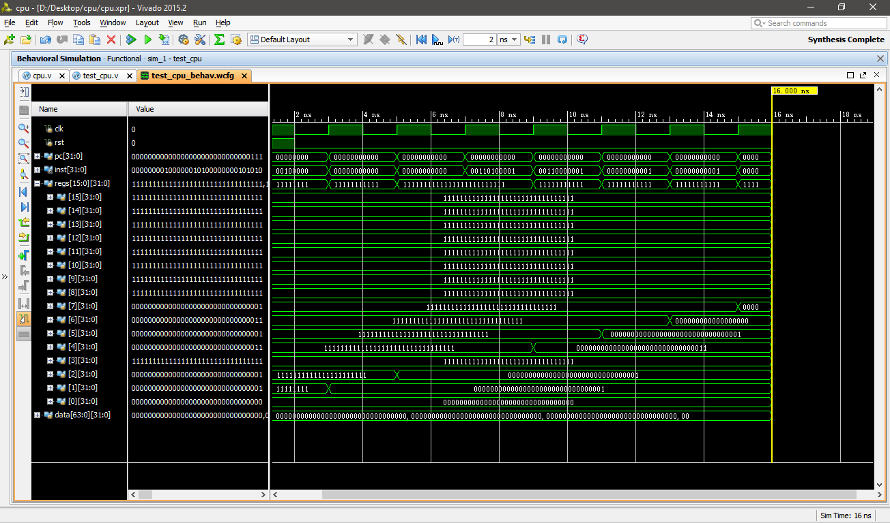

slt, rs=4, rt=1, rd=8 => R[8]=0，将R[4]的值与R[1]的值比大小，结果赋给R[8]，R[4]>R[1]，可以看到波形图中R[8]的值变成了0

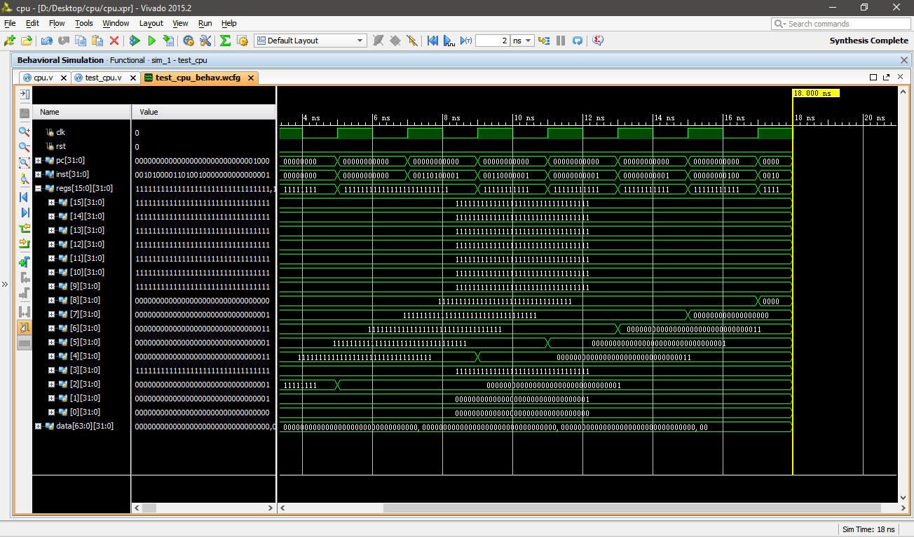

slti, rs=3, rt=9, imm=1 => R[9]=1，将R[3]的值与1比大小，结果赋给R[9]，因为-1<1，所以可以看到波形图中R[9]的值变成了1

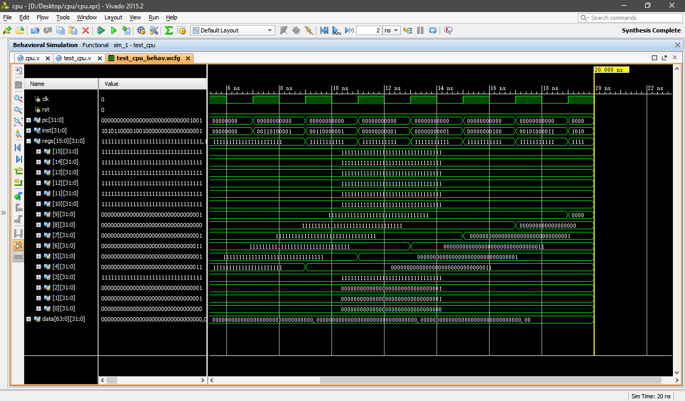

sw, base=R[1], rt=4, offset=1 => Data[2]=3，将R[9]的值加上1，得到的结果作为内存地址，将R[4]的值存入此内存地址中，可以看到波形图中Data[2]的值变成了3

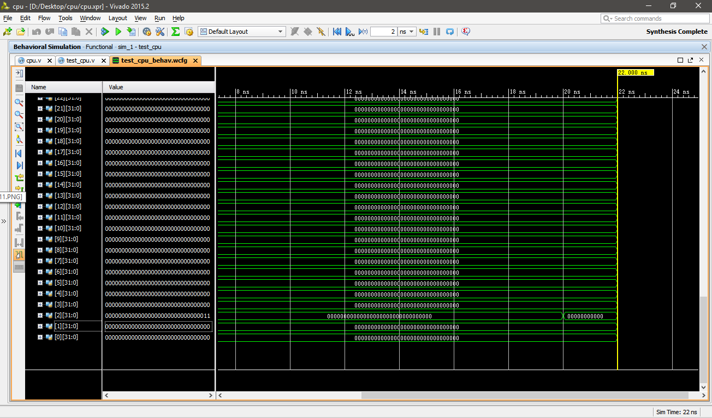

j, address=3 << 2 => jump to 12，跳转到第12条指令，可以看到波形图中的PC值变成了12

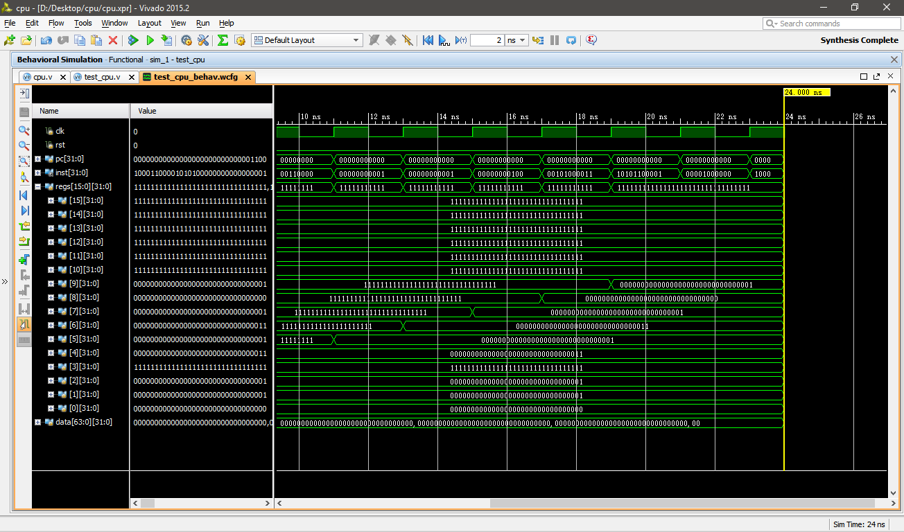

add, rs=0, rt=1, rd=11 => R[11]=1，这条指令将不会运行，图中的R[11]还是-1而不是1

lw, base=R[1], rt=10, offset=1 => R[10]=3，将内存地址中的Data[2]的值存到R[10]中去，注意到上面我们在Data[2]中存储过一个3，可以在波形图中看到R[10]的值变成了3

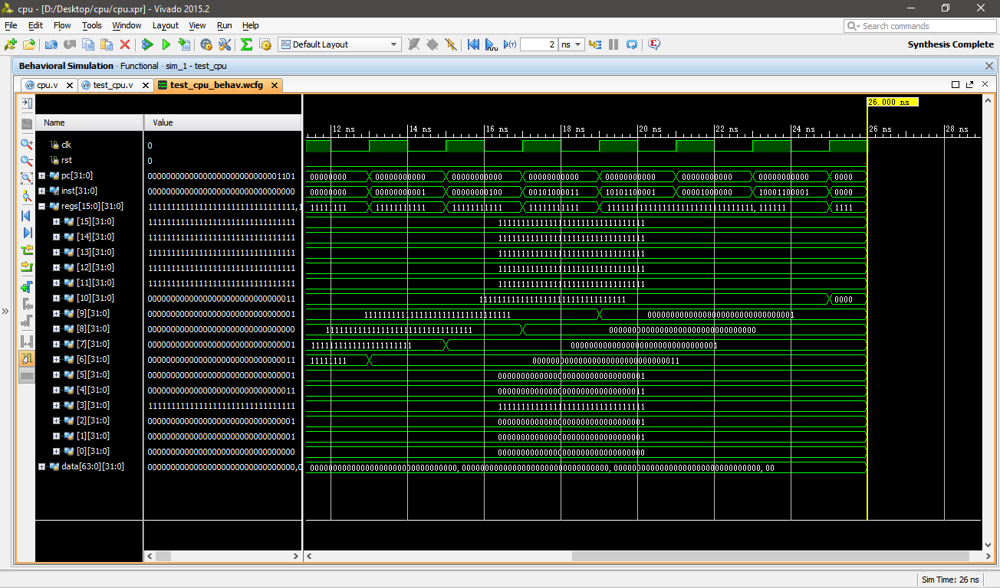

nop，什么都没有发生，PC继续增加


nop，什么都没有发生，PC继续增加

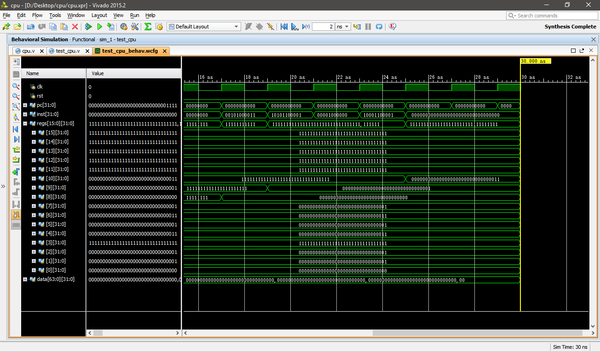

nop，什么都没有发生，PC增加到顶后不再增加

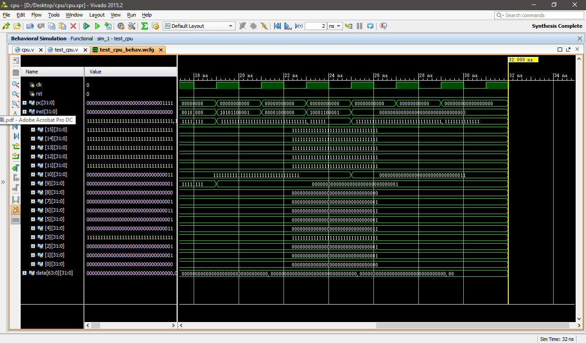

## 体会与感受

看似复杂的CPU也是由较简单的组件集合而成，在设计时，应当先将每个组件的功能、结构理解清楚，再将小组件组装为一个完整地系统，这样可以大大简化复杂系统的分析与设计。

MIPS指令集采用RISC架构，结构清晰、简单，大大简化了CPU的控制模块设计。

通过本次实验，我们对单周期CPU内部的指令执行过程，以及数据流通过程有了更加深刻的理解，并且，最终能够自己运用Vivado 2015.2软件设计出一个简单的单周期CPU，虽然只包含了13条指令，但是却覆盖了较广泛的指令类型，使我们对于CPU的认识不再只局限在理论层次，而是通过亲手实践，对CPU的内部运行机制有个更深一步的理解。

